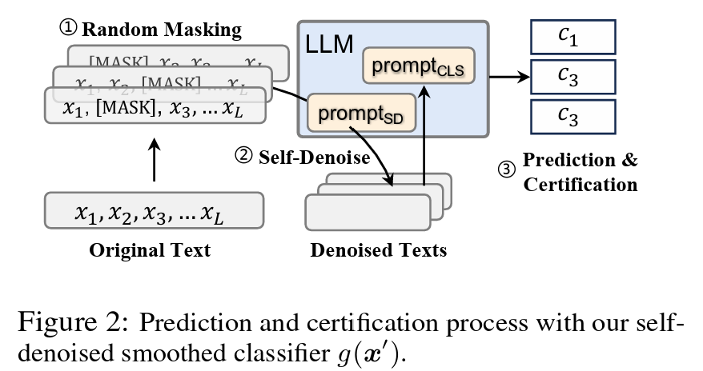

# Certified Robustness for Large Language Models with Self-Denoising
This is the official implementation of the paper [*Certified Robustness for Large Language Models with Self-Denoising*](https://arxiv.org/abs/2307.07171).

## Overview


Although large language models (LLMs) have achieved great success in vast real-world applications, their vulnerabilities towards noisy inputs have significantly limited their uses, especially in high-stake environments. In these contexts, it is crucial to ensure that every prediction made by large language models is stable, i.e., LLM predictions should be consistent given minor differences in the input. This largely falls into the study of certified robust LLMs, i.e., all predictions of LLM are certified to be correct in a local region around the input. Randomized smoothing has demonstrated great potential in certifying the robustness and prediction stability of LLMs. However, randomized smoothing requires adding noise to the input before model prediction, and its certification performance depends largely on the model's performance on corrupted data. As a result, its direct application to LLMs remains challenging and often results in a small certification radius. To address this issue, we take advantage of the multitasking nature of LLMs and propose to denoise the corrupted inputs with LLMs in a self-denoising manner. Different from previous works like denoised smoothing, which requires training a separate model to robustify LLM, our method enjoys far better efficiency and flexibility. Our experiment results show that our method outperforms the existing certification methods under both certified robustness and empirical robustness. 

## Getting Started 

Before running the code, you need to download Alpaca first:
```sh
bash ./config_alpaca.sh
```

Configure the new environment:
```sh
pip install -r ./requirement.txt
```
## Results

### Certified Accuracy


Run scripts under `./code/script/certified` to reproduce the result.`

### Empirical Robust Accuracy


Run scripts under `./code/script/empirical` to reproduce the result.


## Reference
Our code is build based on [RanMASK](https://github.com/zjiehang/RanMASK):
```bibtex
@article{zeng2023certified,
  title={Certified robustness to text adversarial attacks by randomized [mask]},
  author={Zeng, Jiehang and Xu, Jianhan and Zheng, Xiaoqing and Huang, Xuanjing},
  journal={Computational Linguistics},
  volume={49},
  number={2},
  pages={395--427},
  year={2023},
  publisher={MIT Press}
}
```

## Citation
If you find this repository useful, please consider to cite our work:
```bibtex
@article{zhang2023certified,
  title={Certified Robustness for Large Language Models with Self-Denoising},
  author={Zhang, Zhen and Zhang, Guanhua and Hou, Bairu and Fan, Wenqi and Li, Qing and Liu, Sijia and Zhang, Yang and Chang, Shiyu},
  journal={arXiv preprint arXiv:2307.07171},
  year={2023}
}
```
