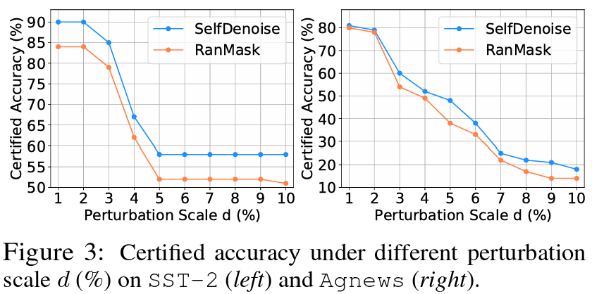
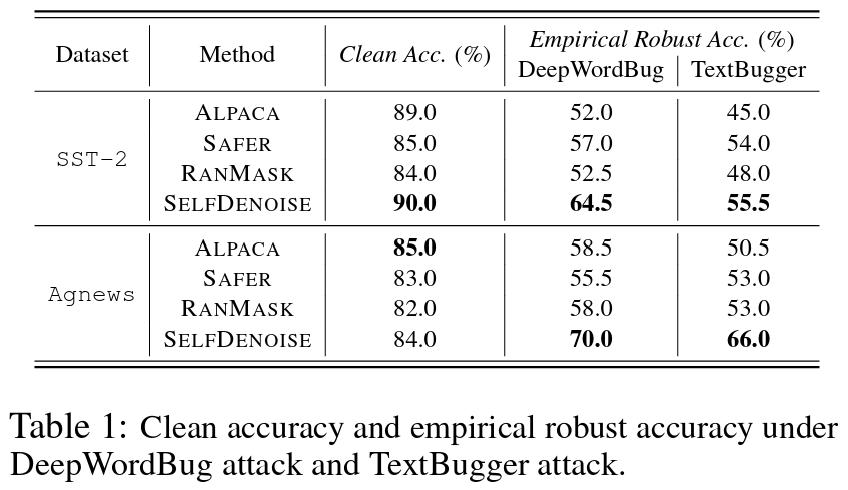

# Certified Robustness for Large Language Models with Self-Denoising
This is the official implementation of the paper *Certified Robustness for Large Language Models with Self-Denoising*.

## Getting Started 

Before running the code, you need to download Alpaca first:
```sh
bash ./config_alpaca.sh
```

Configure the new environment:
```sh
pip install -r ./requirement.txt
```
## Results

### Certified Accuracy

Run scripts under `./code/script/certified` to reproduce the result.

### Empirical Robust Accuracy

Run scripts under `./code/script/empirical` to reproduce the result.


## Reference
Our code is build based on RanMASK:
```bibtex
randomized [mask]
```

## Citation
If you find this repository useful, please consider to cite our work:
```bibtex
@article{zhang2023certified,
  title={Certified Robustness for Large Language Models with Self-Denoising},
  author={Zhang, Zhen and Zhang, Guanhua and Hou, Bairu and Fan, Wenqi and Li, Qing and Liu, Sijia and Zhang, Yang and Chang, Shiyu},
  journal={arXiv preprint arXiv:2307.07171},
  year={2023}
}
```
